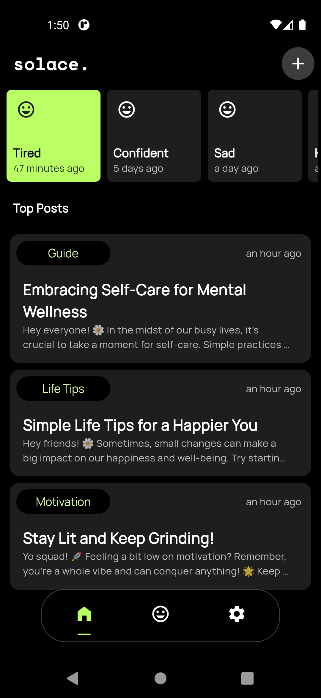

# Solace - a gamified mental wellness app
a gamified mental health platform where users can track their moods, complete daily wellness challenges, and engage with a supportive community, all while earning rewards and maintaining privacy.

## Screenshot

## The Problem
Mental health issues are prevalent and often stigmatized, leading many individuals to suffer in silence. Existing social media platforms lack the focused support and resources needed to effectively address mental well-being. Users need a dedicated space where they can track their moods, access professional advice, engage in wellness activities, and connect with a supportive community without fear of judgment or privacy breaches.